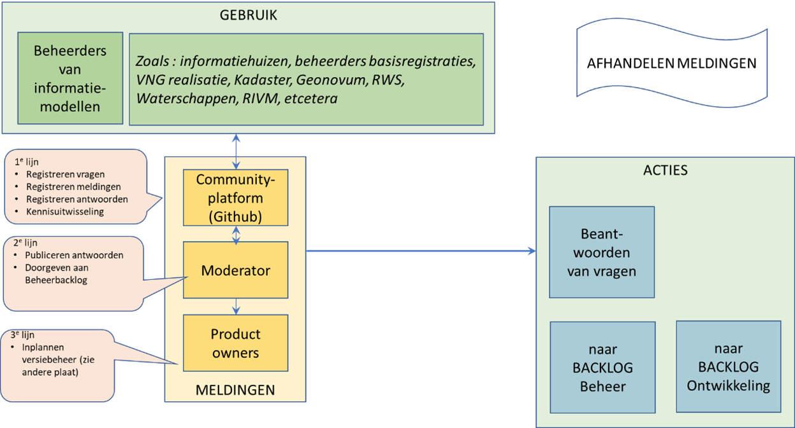

##	Implementatieondersteuning

###	Opleiding en advies

 BOMOS Opleiding: 
 
 Het bieden van opleidingsmogelijkheden aan verschillende gebruikersgroepen variërend van een informatie bijeenkomst tot aan een (online) cursus.

Doelgroep van MIM zijn informatiemodelleurs en technici die informatiemodellen gebruiken in een model driven approach (MDA) omgeving. Deze personen zijn in het algemeen mensen met een technische achtergrond en een hoog zelflerend vermogen. Ondersteuning middels opleiding is daarom beperkt. Het stelt wel hoge eisen aan de documentatie en het inrichten van een community platform.

*Ondersteuning via website* 

De website geeft via de MIM beheerpagina toegang tot de standaard, tips and tricks, FAQ.

*Inrichten van gebruikersplatform*

GitHub MIM omgeving inrichten en gebruiken als gebruikersplatform.

*Workshops*

Middels workshops gericht op de toepassing binnen een domein wordt de inhoud en toepassing onder de aandacht gebracht. Denk daarbij aan workshop binnen de DSO context, binnen NEN3610 context, VNG realisatie, Kadaster, GAB.
Binnen beheer wordt workshopmateriaal ontwikkeld. Dit materiaal kan ook door derden worden gebruikt.

### Helpdesk

 BOMOS Helpdesk: 
 
 Het bieden van ondersteuning aan verschillende gebruikersgroepen, bijvoorbeeld telefonisch of per e-mail volgens een service level agreement (bijv. beantwoording van vragen binnen 24 uur). Een frequently asked questionslijst opstellen en bijhouden kan ook een helpdeskactiviteit zijn.

*Vragen*

De gebruikersgroep van MIM is relatief beperkt. Een voorzichtige schatting is dat op enig moment niet meer dan 50 mensen actief MIM toepassen. Voor een deel kunnen vragen ook binnen de community opgelost worden. Het heeft daarom de voorkeur om alle vragen op het gebruikers platform te posten en ook derden de mogelijkheid te geven te antwoorden. De beheerorganisatie is echter bij alle vragen verantwoordelijk dat er een antwoord komt.

Een startlijst met FAQ wordt opgesteld en aangevuld op basis van de binnenkomende vragen.

*Meldingen*

Opmerkingen over de inhoud van de MIM standaard mbt fouten of ontbrekende functionaliteit kunnen worden ingediend via de helpdesk. Lijst wordt gepubliceerd en de beheeragenda wanneer meldingen worden getoetst en of als wijzigingsvoorstel worden opgenomen en in procedure gaan.

*Moderator*

De moderator draagt er zorg voor dat het community-platform up-to-date is. Hij zorgt er ook voor dat meldingen worden doorgezet nar de product owners van de standaard. Hij plaats daarnaast zaken op de backlog van het beheer die direct opgepakt moeten worden door beheer en die niet via ontwikkeling lopen.
De rol van moderator wordt opgepakt door de beheerder van de standaard.

*Product owners*

Dit zijn vertegenwoordigers van Kadaster, VNG Realisatie en Geonovum die samen verantwoordelijk zijn voor het coördineren van wijzigingen van de standaard op basis van behoeften uit het werkveld. Ze onderhouden de backlog ten behoeve van ontwikkeling en maken daaruit voorstellen voor de inhoud van nieuwe versies van de standaard.

### Moduleontwikkeling (tooling) 

 BOMOS Moduleontwikkeling: 
 
 (Stimuleren van) de ontwikkeling van breed te verspreiden applicaties (software) die de standaard implementeren. Dit kan door het stimuleren van de markt om software te ontwikkelen, of, als de markt niet beweegt, zelf software te ontwikkelen en te verspreiden om de markt in beweging te krijgen.

Het MIM wordt toegepast in een software-omgeving voor het ontwikkelen van UML modellen. Voor deze toepassing zijn er voldoende internationale softwarepakketten. Voor het faciliteren van het MIM conform werken in die pakketten is er een MIM profiel gemaakt dat geimporteerd kan worden. 

UML en ook MIM ondersteunt een model driven approach (MDA) waarbij vanuit de UML omgeving en middels MIM conforme UML model afgeleide producten kunnen worden gegenereerd: berichtenverkeerspecificaties (XML, RDF, JSON etc), objectcatalogi in verschillende formats (html, skos, RDF etc). Deze producten zijn gerelateerd aan afspraken die in MIM zijn vastgelegd. Hiervoor zijn geen standaard software producten. In het beheer wordt software ontwikkeling gestimuleerd middels een samenwerking met ontwikkelaars van de Imvertor plugin software.

###	Pilot

 BOMOS Pilot: 
 
 Proeven met de implementatie van de specificaties. Bij sommige standaardisatieorganisaties is het verplicht dat er één of meerdere pilots zijn geweest voordat de standaard officieel vrijgegeven wordt.

Voor het MIM worden geen pilots gedaan

### Validatie & Certificatie

 BOMOS Validatie & Certificatie: 
 
 Het bieden van mogelijkheden om de correctheid van de implementaties te testen (validatie). Daaraan kan een officieel traject verbonden worden wat leidt tot certificatie van een organisatie of product. Ook verplicht stellen van het doorlopen van validatie en certificatietrajecten behoort tot de mogelijkheden.

Voor het MIM komt er in deze fase geen officiële validator of certificatie autoriteit. De genoemde Imvertor plugin software zal wel een validatie functionaliteit bevatten. Deze is echter vooral faciliterend en adviserend voor een correcte toepassing.

Het beheer ondersteunt ook audits, reviews, van MIM conforme modellen. Een MIM toepassing kan ter review op MIM specificaties worden aangeboden. De review is ondersteunend en adviserend van karakter.

 

