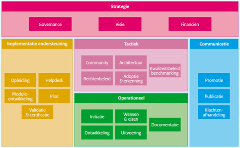
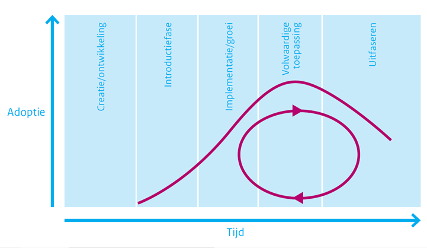

##	Inleiding

###	Leeswijzer

Dit document is een plan op basis waarvan het beheer van de standaard Metamodel Informatiemodellering (MIM) wordt uitgevoerd. Dit plan geeft inzicht in de inhoud en omvang van de relevante beheerprocessen en welke middelen en functieprofielen hiervoor nodig zijn.
Dit document beschrijft hoe Geonovum MIM (Metamodel Informatie Modellering) beheert.

### Standaarden voor informatie

Informatie is een motor onder het functioneren van de overheid in Nederland. In het kader van onderlinge samenwerking, wisselen overheidsorganisaties veel informatie uit. Daarbij is het van groot belang dat we hetzelfde verstaan onder de gegevens die we gebruiken en dat we gemeenschappelijke afspraken maken over hoe we gegevens beschrijven en uitwisselen.
Bij de ontwikkeling van het Digitaal Stelsel Omgevingswet (DSO) is duidelijk naar voren gekomen dat veel informatiebronnen bij elkaar komen in de zogenaamde informatiehuizen. Daarbij komen ook de wereld van de geografische gegevens en de wereld van de meer administratieve registraties bij elkaar. Dit biedt mogelijkheden om informatie slim te combineren maar maakte ook een aantal verschillende uitgangspunten zichtbaar in de werkwijzen van Kadaster, VNG Realisatie en Geonovum als het gaat om het modelleren van informatie.

 Voor inhoudelijke informatie over MIM, zie: https://www.geonovum.nl/geo-standaarden/metamodel-informatiemodellering 

Met MIM hebben we een gemeenschappelijk vertrekpunt opgesteld voor het maken van informatiemodellen. Het model bevat duidelijke afspraken over het vastleggen van gegevensspecificaties en biedt tegelijkertijd ruimte aan de verschillende niveaus van modellering. Bijzonder aan het model is dat de afspraken over meerdere bestuurslagen heen gaan.
Geonovum werkt bij het maken van informatiemodellen op basis van dit metamodel voor informatiemodellering en naar het Basismodel geo-informatie (NEN3610) wat ook het MIM volgt.

Het metamodel is bestemd voor informatiearchitecten die informatiemodellen maken, informatieanalisten die willen weten wat de betekenis en definitie van informatieobjecten is en mensen die implementaties maken op basis van het model. Voor het werken met dit model is kennis van informatiemodellering is een vereiste. Enige kennis van UML is een pré. Het metamodel richt zich op registraties binnen het overheidsdomein, maar is in bredere context inzetbaar.
Het metamodel is beschikbaar in versie 1.0. 

### BOMOS

Geonovum richt de beheerorganisatie in conform BOMOS. Ook het beheer van MIM is op basis van BOMOS ingericht.
Voor de beheerorganisatie heeft Geonovum een generiek beheerplan opgezet, waar het beherplan van MIM van is afgeleid (https://www.geonovum.nl/uploads/documents/Geonovum%20GENERIEK%20Beheerplan%20geo-standaarden%20v1.1.pdf) 

Voor meer informatie over BOMOS zie : https://beslisboom.forumstandaardisatie.nl/thema/ontwikkelen-en-beheren-van-open-standaarden.

BOMOS onderscheidt verschillende levenscyclusfases waarin een standaard zich kan bevinden, namelijk:
1.	Creatie/ontwikkeling
2.	Introductie
3.	Implementatie/groei
4.	Volwaardige toepassing
5.	Uitfaseren

De MIM-standaard bevindt zich in de fase van implementatie en groei van de standaard. BOMOS zegt daar het volgende over:
"In deze fase kiezen gebruikers bewust voor de implementatie van de
standaard. In het beheer wordt ook rekening gehouden met het feit dat
niet alle gebruikers beschikken over een volwaardig kennisniveau van de
standaard. Beheer betekent in deze fase ook de ondersteuning en het
informeren van de gebruikers. Marketingtermen als ‘early majority’ zijn in
deze fase van toepassing. Uw activiteiten zijn gericht op meer professionele
adoptie en professionalisatie van de open beheerprocessen, zodat bij
opschaling van het gebruik alle partijen aangehaakt blijven en de processen
transparant verlopen. Registraties van gebruikers/ afnemers/ experts etc.
worden steeds belangrijker."

