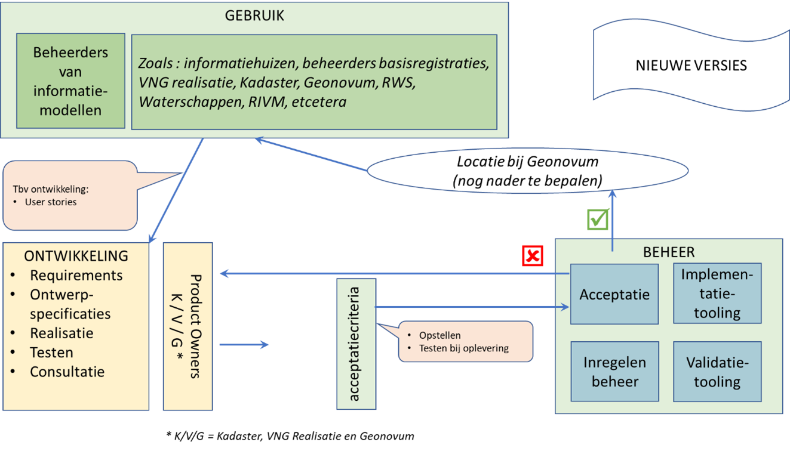

##	Operationeel

###	Initiatie

 BOMOS Initiatie: 
 
 Identificatie van nieuwe ideeën (voor bijvoorbeeld een nieuwe specificatie en nieuwe werkgroep) en alle activiteiten die horen bij het succesvol optuigen daarvan (bijv. belangenanalyse, business case, agendering).

Ideeën en wensen over toepassing, gebruik en functionaliteit van MIM komen binnen via de helpdesk of de MIM stakeholders georganiseerd in de werkgroep. Kleine wijzigingen die nog backwards compatible zijn met de actuele MIM versie worden binnen het tijdelijk beheer opgelost. Indien de wijziging een grote impact op de standaard heeft valt dit buiten de reguliere beheeropdracht. De beheerorganisatie treedt wel faciliterend op door in dat geval het proces te organiseren om via een additionele opdracht het adaptief en additief onderhoud te kunnen uitvoeren. De beheerorganisatie zelf is al ingericht om het werkveld te betrekken.

 

###	Wensen en Eisen

 BOMOS Wensen en Eisen: 
 
 Opstellen van de wensen en eisen aan de te ontwikkelen en te beheren specificatie, ook wel bekend onder de naam Maintenance Requests (MRs).

Wensen en eisen komen binnen via de helpdesk en aangesloten stakeholders. Binnen het opgestelde plan voor versiebeheer wordt een beheeragenda opgesteld. Binnen gekomen wijzigingsvoorstellen worden gecategoriseerd in:
-	correctief
-	preventief
-	adaptief
-	additief

Correctief en preventief onderhoud wordt opgepakt door tijdelijk beheer en aldaar op de backlog geplaatst. Additief en adaptief onderhoud wordt via de product owners op de backlog van ontwikkeling geplaatst. Afhankelijk van de omvang van deze wijzigingen zal bepaald worden of hiervoor apart budget voor nodig is.

De impact van de wijziging op de standaard wordt bepaald. Versiebeheer protocol en beheeragenda bepalen wanneer een wijzigingsvoorstel wordt geïmplementeerd.

###	Uitvoering

 BOMOS Uitvoering: 
 
 De daadwerkelijk aanpassingen op basis van de conceptuele oplossingen doorvoeren in de specificatie en eventuele technische invulling.

*Helpdesk* 

Na ontvangst van de vraag bij de helpdesk van MIM ontvangt de vraagsteller van Geonovum een ontvangstbevestiging. De helpdeskmedewerker kent aan de melding een actiehouder toe.

*Registratie en publicatie*

Alle bij de helpdesk binnen gekomen vragen, dan wel wensen of fouten, worden geregistreerd in het helpdesk systeem (GITHUB). Wanneer blijkt dat een vraag/ melding een wijzigingsverzoek is, dan wordt deze opgenomen in de meldingenlijst die per standaard via de Geonovum website inzichtelijk is. In de lijst is voor iedereen te zien wat de status van de melding is en of deze wordt of is meegenomen in een volgende wijziging van de standaard. Een vraag over de standaard wordt niet aan de meldingenlijst toegevoegd maar afgehandeld via de helpdesk. 

*Meldingen formulier*

Naast een overzicht van meldingen per standaard kan een gebruiker van een standaard ook per formulier een wens, eis of fout aan ons kenbaar maken. Iedere standaard heeft op de Geonovum hiervoor een formulier beschikbaar. Degene die een melding maakt, vult naast contactgegevens ook het voorstel tot wijziging met een toelichting daarop in. Het is ook mogelijk bestanden aan de melding toe te voegen.

###	Ontwikkeling

 BOMOS Ontwikkeling: 
 
 Op conceptueel niveau de inhoudelijke uitwerking van oplossingen voor de ideeën, wensen en eisen opgesteld in voorafgaande fasen. Deze oplossingen zijn zoveel mogelijk los van technologieën bedoeld voor nadere uitwerking in een (nieuwe versie van) de specificatie.

####	Standaardenagenda

*Algemeen*
Met behulp van de standaardenagenda geven we inzicht in onze jaarlijkse werkzaamheden en activiteiten rondom de standaarden. De standaardenagenda wordt jaarlijksvastgesteld door de programmaraad en gepubliceerd op de website van Geonovum. De standaardenagenda is een vertaling van requirements en ontwikkelingen vanuit het werkveld. Het werkpakket benoemd in de standaardenagenda is te herleiden naar de activiteiten voor ontwikkeling en beheer conform BOMOS.

*Specifiek*
In afstemming met de governance structuur en in overleg met de stakeholders wordt jaarlijks een MIM beheeragenda opgesteld. 
De MIM beheeragenda stemt waar nodig af met de algemene standaardenagenda.

####	Wijzigingsbeheer 

 De volgende procedurestappen worden voorgesteld (Conform GENERIEK Beheerdocument):

Belanghebbenden kunnen meldingen (wijzigingsverzoeken), variërend van wensen tot aanpassing van en fouten in MIM, indienen bij Geonovum. Wij geven inzicht in de ontvangen meldingen
en bundelen de verzoeken tot een wijzigingsvoorstel in het geval we een wijzigingsproces starten voor een nieuwe versie van de standaard. Het wijzigingsprotocol (zie volgende paragraaf ) beschrijft het wijzigingsproces en daarmee ook de procedure die het wijzigingsvoorstel doorloopt. 
Voor de registratie van meldingen wordt er een GitHub platform ingericht. Een moderator organiseert het beheer van de GitHub. Meldingen worden gecategoriseerd en in procedure genomen.
De volgende procedurestappen worden voorgesteld (Conform GENERIEK Beheerdocument):

| Status voorstel | Beschrijving activiteiten |
|--------------------|----------------------------|
| NIEUW | Als een gebruiker een melding indient krijgt deze de status “nieuw”. |
| TERUGKOPPELING | De actiehouder van de melding controleert of de melding volledig en helder is. Bij een fout gaat hij/zij in de standaard na of dit inderdaad het geval is. Hij/zij kan informatie opvragen of een onderzoek uitvoeren. |
| ERKEND |Deze melding is helder beschreven en is of een wens voor het aanpassen van de standaard, dan wel een gevonden fout. Ook is de melding geen duplicaat van een reeds ingevoerde melding. De melding is hiermee formeel opgenomen in het meldingen systeem. |
| BEVESTIGD | Geonovum neemt deze melding mee in het wijzigingsproces van de standaard. |
| TOEGEWEZEN | De melding is toegewezen aan een actiehouder en gekoppeld aan een nieuwe versie van de standaard. |
| OPGELOST | De melding is opgelost als de melding onderdeel is van de nieuwe versie van de standaard. |
| AFGESLOTEN | De melding wordt afgesloten in de volgende situaties: |
| |- wanneer de melding is opgenomen in de nieuwe versie van de standaard;|
| |- wanneer de wens niet wordt gehonoreerd in de nieuwe versie van de standaard;|
| |- wanneer de fout niet meer relevant wordt geacht voor de standaard. |
| | De precieze informatie hierover staat in de melding onder het attribuut ‘oplossing’. Indien een melding uiteindelijk niet is meegenomen in de nieuwe versie van de standaard maar wel een fout/ wens blijft, wordt de status teruggezet op erkend. |
	
 
	
	

 

####	Wijzigingsprotocol

Een wijzigingsprotocol beschrijft de manier waarop wijzigingen in de standaarden plaatsvinden: het wijzigingsproces. In het protocol zijn basisbegrippen en uitgangspunten uiteengezet voor het wijzigingsproces, bijvoorbeeld wat onder nieuwe en volgende versies verstaan wordt en wanneer dezeverwacht mogen worden. 

Met behulp van een wijzigingsprotocol voor de standaarden geeft Geonovum:

- inzicht in het behandel- en besluitproces dat ten grondslag ligt aan het versiebeheer;
- inzicht in de aangeboden wijzigingsvoorstellen;
- stabiliteit aan de standaard;
- continuïteit aan de standaard.

Het wijzigingsproces doorloopt de fasen Inhoud, Toetsing, Besluitvorming en Implementatie, zoals weergegeven in Figuur 1. Iedere fase kent vaste stappen die tijdgebonden zijn met een vaste datum van inwerkingtreding van de nieuwe versie van de standaard. De fase Toetsing vormt een brug tussen de inhoud, besluitvorming en de implementatie. In deze fase wordt de inhoudelijke correctheid, de technische haalbaarheid en impact van de voorgestelde wijzigingen getoetst, als de aard van de wijziging dit noodzakelijk maakt. Er is een wezenlijk verschil met besluitvorming. Bij het toetsen wordt de inhoudelijke correctheid vastgesteld, bij besluitvorming de wenselijkheid om de voorgestelde wijzigingen door te voeren. 
Het resultaat van de fase Toetsing is een (mogelijk aangepast) volledig wijzigingsvoorstel voor de standaard, dat is gevrijwaard van fouten en waarvan de technische haalbaarheid en impact is getoetst.

Fasen wijzigingsproces

####	Versiebeheer

Bij een standaard in beheer horen ook afspraken over het versiebeheer. Versies van een standaard zijn er in verschillende gradaties die elk een relatie hebben met een voorgaande versie. De wijzigingendocumenteren wij en leggen wij vast in de uitgebrachte versie van de standaard als release notes. Degebruiker kan zo nagaan op welke plaatsen de standaard gewijzigd is.

Geonovum hanteert drie typen versies voor een wijziging van de MIM standaard. Bijvoorbeeld: versie 2.1.0 (=X.Y.Z):

| Type | Toelichting |Frequentie|
|-----------------|---|---|
| X-wijzigingen | Deze wijzigingen veranderen de structuur van de standaard. Hierdoor zijn X-wijzigingen niet backwards compatible. |maximaal 1 keer per jaar. |
| Y-wijzigingen | Dit zijn wijzigingen die niet de structuur veranderen. Dit kunnen bijvoorbeeld updates zijn of inhoudelijke aanpassingen aan objecten, attributen of waardelijsten of de reikwijdte van de standaard. Deze wijzigingen zijn backwards compatible. | maximaal 2 keer per jaar. |
| Z-wijzigingen | Dit zijn in feite oplossingen van technische fouten of verbeteringen van technische aard. Deze wijzigingen zijn backwards compatible. | zo spoedig mogelijk na constatering. |

Na het uitbrengen van een nieuwe versie van de MIM standaard blijven oudere versies beschikbaar. en zijn vindbaar via de Geonovum website en het technisch register (http://register.geostandaarden.nl/). Een nieuwe versie dwingt daarmee geen directe overstap af bij de gebruikers, tenzij anders (bijvoorbeeld wettelijk) bepaald. Na het uitbrengen van de nieuwe versie van een standaard wordt de ontwikkeling van de oude versie stopgezet.

Voor het onderhoud en de ondersteuning van een oude versie van een standaard gelden de volgende uitgangspunten:

- Aan een oude versie worden geen nieuwe features toegevoegd na het uitbrengen van een nieuwe versie.Verzoeken om aanpassing en wijziging voor nieuwe functionaliteit worden niet meer voor de oude standaard in behandeling genomen.
- De opdrachtgever stelt met advies van de beheerder vast hoelang een oude versie wordt ondersteund en wanneer hij komt te vervallen (decline). Dit betekent dat vragen over het gebruik van de standaard worden beantwoord. De maximale ondersteuningstermijn is twee jaar. Daarna blijft de versie van de standaard wel beschikbaar, maar biedt Geonovum geen ondersteuning meer. 

###	Documentatie

 BOMOS Documentatie: 
 
 Verzorgen van passende neerslag van de resultaten van het primaire beheerproces. Niet alleen de beschikbaarheid van de specificaties, maar bijvoorbeeld ook de mogelijkheid bieden tot een historisch overzicht van verzoeken tot wijzigingen (maintenance requests) en de actuele status daarvan.

####	Soorten documenten

Het MIM is een Meta Informatiemodel en is een standaard waarbij door de term informatiemodel te hanteren wordt aangegeven dat het een abstractie (het model) vormt van de abstractie (het model) werkelijkheid zoals beschreven binnen een bepaalde sector/domein. Dit model maakt het mogelijk om Informatiemodellen die een semantische invulling van normen voor sectoren (zoals ruimtelijke ordening, kabels en leidingen, water, etc) te modelleren.

De MIM standaard wordt formeel beschreven in een MIM standaarddocument. Publicatieomgeving hiervoor is Respec.

MIM gerelateerde documenten worden gepubliceerd op de MIM pagina van de website van Geonovum.
dit betreft onder meer :
-	het Enterprise Architect MIM-UMLprofiel
-	de Enterprise Architect MIM-UMLtoolkit

####	Hulpmiddelen

-	Agenda, dan wel planning;
-	Helpdesk en veel gestelde vragen;
-	Informatie over eventuele werkgroepen;
-	Publicatie als ook presentaties, filmpjes, artikelen die de toepassing van de MIM toelichten;
-	Meldingen, via GitHub
-	Nieuwsberichten

###	Technische hulpmiddelen

Hulpmiddelen betreffen de tooling van de beheeromgeving. Geonovum maakt bij voorkeur gebruik van tooling die ook bij de andere door Geonovum beheerde standaarden worden gebruikt. 

Bij het MIM wordt gebruik gemaakt van:
-	Geonovum website voor MIM startpagina
-	Respec voor publicatie omgeving, zoals consultatie en documentatie
-	GitHub voor community-platform
-	GitHub voor meldingen-platform, zoals beheer van de backlog
-	Imvertor voor validatie. Dit wordt ook gebruikt als implementatietool.
-	UML-tool voor ontwikkelen

MIM is een metamodel voor informatiemodelleren en is onafhankelijk van een modelleertaal of modelleersoftware. Er is voor MIM een toepassing in UML en in Linked Data uitgewerkt. Voor andere modelleertalen zou dat ook kunnen maar dat heeft nu geen aandacht. Voor wat betreft MIM toepassing in modelleersoftware is er voor Enterprise Architect van Sparx een serviceproduct gemaakt voor het inladen van een MIM profiel en toolbox. We hebben geen andere UML tooling geidentificeerd waarvoor binnen het MIM beheer een dergelijk serviceproduct ontwikkeld zou moeten worden. De markt kan hier ook zelf actie in ondernemen.
Imvertor van Armatiek is een sofwaretool voor Model Driven generatie van afgeleide producten uit MIM modellen waaronder xml, json en rdf implementaties.

### Validatie 

Een gebruiker kan de conformiteit van de implementatie van MIM laten toetsen door expertbeoordeling, dit is echter nog niett formeel en structureel ingericht. 

Er is een testsuite gemaakt voor het toetsen van MIM conformiteit. De testsuite is vooralsnog alleen voor intern gebruik bij Geonovum, waarbij dit document wordt gehanteerd: https://github.com/Geonovum/MIM-Werkomgeving/tree/master/MIM-Conformiteitstoets/toetsdocumenten.

De IMvertor software van Armatiek heeft een technische MIM validatie. De validatie heeft geen status binnen het MIM beheer maar helpt het werkveld wel in een juiste MIM toepassing.

###	Personeel

####	Algemeen

MIM is weliswaar geen beheerintensieve standaard maar wel een zeer kennisintensieve standaard. Kennisniveau, ervaring, netwerk en samenwerkingssensitiviteit zijn van belang. Het volgende profiel van een beheerder is hiervoor nodig.

####	Profielen

Voor het profiel van de beheerder wordt gebruik gemaakt van het profiel van het generieke profiel voor de senior adviseur NGII wat bij Geonovum wordt gehanteerd.:

**Profiel 	Functie senior adviseur NGII (m/v)**

*Context*

De overheid beter laten presteren met geografische informatie (geo-informatie). Dat is waar de medewerkers van Geonovum dagelijks aan werken. Wij doen dat door met standaarden de uitwisseling en het gebruik van geo-informatie onderling en met andere soorten informatie mogelijk te maken en de gedeelde informatiepositie voor geo-informatie te verbeteren. Daarnaast helpen wij overheidsorganisaties door hen te informeren over bestaande voorzieningen en door organisaties die behoefte hebben aan geo-informatie te verbinden aan partijen die hen daarmee kunnen helpen.

Geonovum is een compacte overheidsstichting met veel kennis en een rijk netwerk. Wij opereren doelgericht en pragmatisch. Onze inhoudelijke specialismen zijn de standaardisatie en architectuur van de nationale geo-informatie infrastructuur (NGII). Onze organisatorische expertise ligt in het vermogen om verschillende partijen met elkaar te verbinden en om samenwerking tot stand te brengen.

*Rol*
De senior adviseur is een autoriteit op het gebied van de NGII. Hij (m/v) overziet en doorziet de betekenis van de data, architectuur, standaarden, services en andere onderdelen van deze infrastructuur voor de Nederlandse overheid. Bovendien volgt hij relevante nationale en internationale ontwikkelingen en vertaalt deze naar strategische en tactische gevolgen voor het gebruik, de specificaties en randvoorwaarden voor de NGII, en naar advies voor beleid, wetgeving en/of uitvoering.

In samenwerking met anderen, binnen en buiten Geonovum, ontwikkelt en beheert de senior adviseur de architectuur, standaarden en/of andere onderdelen van de NGII, en adviseert overheidspartijen en het bedrijfsleven over deze infrastructuur. Hij heeft een aantal reguliere taken (doorlopend) en voert opdrachten (tijdelijk) uit, zelfstandig en/of met anderen.

Binnen Geonovum maakt de senior adviseur deel uit van het team geo-adviseurs. Hij geeft functioneel en operationeel leiding aan andere geo-adviseurs. Hiërarchisch valt hij onder de directe verantwoordelijkheid van de directeur.

*Taken*
Het team met geo-adviseurs is verantwoordelijk voor de volgende taken; het takenpakket van de senior adviseur NGII bestaat uit een combinatie van deze taken:
-	uitvoeren van standaardisatiewerk in het kader van het basisprogramma van Geonovum:
-	communicatie en advies: voorlichting geven en vragen beantwoorden over geo-standaarden en de -basisarchitectuur en advies en ondersteuning geven bij de implementatie ervan;
-	ontwikkeling: (door)ontwikkelen van een basisarchitectuur voor de NGII in afstemming met onder meer NORA en internationale architecturen, ontwikkelen van nieuwe geo-standaarden in afstemming met internationale standaarden met gebruikers, herzien en/of uitfaseren van bestaande geo-standaarden, signaleren en volgen van internationale ontwikkelingen, deelnemen namens Nederland aan internationale geo-standaardisatiefora en als beheerder van geo-standaarden aan discussies en trajecten voor de ontwikkeling van nieuwe sectorale informatiemodellen;
-	wijzigingsbeheer: intake en behandelen van wijzigingsverzoeken voor bestaande geo-standaarden, doorvoeren van wijzigen met gebruikers, afstemmen van sectorale informatiemodellen met NEN3610 en van bestaande geo-standaarden met relevante internationale standaarden;
-	validatie en certificering: ontwikkelen en beheren van validering en conformiteitstoetsing voor geo-informatie, -services en –software op geo-standaarden;
-	tools en testbeds: ontwikkelen van testdatasets en voorbeelden voor testcases, organiseren van testbeds met overheden, wetenschap en bedrijfsleven, opzetten en beheren van catalogues en registers, monitoren van de invoering en het gebruik geo-standaarden;
-	verwerven, leiden en uitvoeren van opdrachten op het gebied van de NGII, waaronder: 
-	administratie: opstellen van offertes, facturen, voortgang- en eindrapportages;
-	projectmanagement: aansturen projectteam, bewaken en sturen op tijd, geld en kwaliteit binnen de gestelde kaders, onderhouden van contact met opdrachtgevers en andere betrokken partijen;
-	inhoudelijk werk: ontwikkelen, beheren van en adviseren over (onderdelen van) de NGII, vergelijkbaar met de taken in het basisprogramma;
-	afstemmen en bespreken van de voortgang en ontwikkelingen in het standaardisatiewerk in het basisprogramma en opdrachten met het team geo-adviseurs.

*Opleiding, kennis en ervaring*
-	Academisch werk- en denkniveau, met bij voorkeur een opleiding op het gebied van geodesie, geo-informatiekunde of aanverwant;
-	Strategisch inzicht in:
 -	de mogelijkheden van informatietechnologie in het algemeen en geo-informatie en geo-informatietechnologie in het bijzonder;
 -	de betekenis en de rol van de overheid, het bedrijfsleven en technologische doorbraken bij het tot stand komen van de NGII;
-	Vooraanstaande kennis van, ervaring en affiniteit met:
 -	(onderdelen van) de NGII, waaronder de geo-standaarden van ISO, CEN en NEN, en inzicht in hun onderlinge samenhang;
 -	informatieanalyse en -modellering in UML en GML;
 -	het geo-werkveld;
 -	businessprocessen van de overheid;
 -	projectmatig werken en projectgestuurde organisaties;
-	Minimaal 5 jaar ervaring in een soortgelijke functie.

*Competenties*

-	conceptuele flexibiliteit, omgevingsbewustzijn, visionair, overtuigingskracht, projectmatig werken, plannen en organiseren, analytisch, consistent, advies- en communicatief vaardig, creatief

