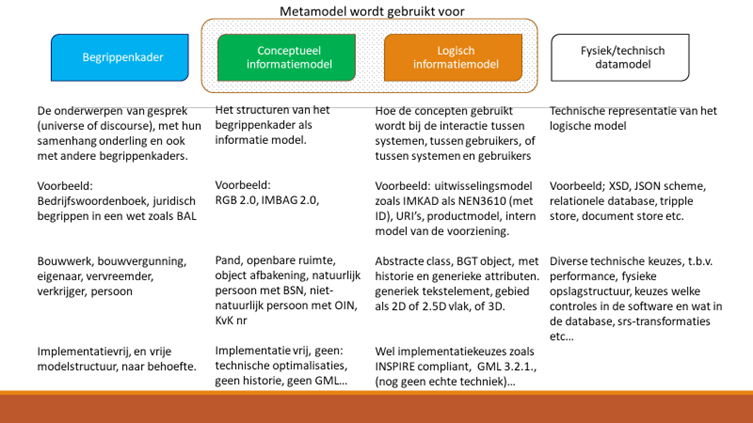

##	Strategie

### Visie

 BOMOS Visie: 
 
 Inhoudelijke visie ontwikkelen over de richting van de ontwikkeling. De plek op de horizon op de lange termijn.

Veel verschillende partijen maken meervoudig gebruik van gegevens. Het is daarbij van belang dat de onderlinge samenhang en betekenis van de gegevens binnen een bepaalde context wordt beschreven. Dit gebeurt met behulp van informatiemodellen. Het doel van een informatiemodel is een beschrijving van (de informatie over) de werkelijkheid, los van implementatieaspecten. Het is h van grote meeerwaarde dat informatiemodellen op dezelfde manier beschreven worden, gebaseerd op dezelfde standaard”.

**Belang Meta Informatie Modellering (MIM)**

Het MIM-metamodel verschaft een gemeenschappelijk vertrekpunt voor het opstellen van informatiemodellen. Dit is van belang aangezien er steeds meer wordt samengewerkt en informatie wordt uitgewisseld tussen verschillende overheidslagen en -instanties. Om dit effectief te doen moeten we hetzelfde verstaan onder de gegevens die we gebruiken en gemeenschappelijke afspraken hebben over de wijze van beschrijven van gegevens en de manier waarop we deze uitwisselen. Het MIM-metamodel voorziet enerzijds in duidelijke afspraken over het vastleggen van gegevensspecificaties en biedt anderzijds ruimte aan de verschillende niveaus van modellering. Bijzonder aan het MIM-metamodel is dat er afspraken worden gemaakt die over meerdere bestuurslagen heen gaan. De opstellers zijn er daarbij van overtuigd dat het MIM-metamodel gaat leiden tot vergelijkbare modellen voor delen van de overheidsinformatievoorziening, zoals bijvoorbeeld de informatiehuizen in het Digitaal Stelsel Omgevingswet (DSO), en houvast geeft bij het opstellen van informatiemodellen ongeacht het beschouwingsniveau dat van toepassing is.

MIM richt zich specifiek op objectmodellering. Voor informatiemodellen die daar niet op gericht zijn en bijvoorbeeld op documentmodellering, is MIM niet richtinggevend.

**Belang Handreiking Informatie Modelleren (HIM)**

De Handreiking voor Informatie Modelleren richt zich specifiek op informatiemodellen voor het beschrijven van informatieproducten of datasets die gedeeld c.q. uitgewisseld, of geraadpleegd worden in de context van het DSO. Het zijn informatieproducten waarvan standaardisatie nodig is in het kader van interoperabiliteit. Specifiek is de handreiking voor informatiehuizen en de vanuit die huizen ontsloten informatieproducten. De HIM maakt daarbij gebruik van het MIM-metamodel. 
De HIM is als referentiemateriaal ook bruikbaar buiten het DSO-domein 

 
 

###	Governance

 BOMOS Governance: 
 
 Beleid uitzetten over de eigen bestuurlijke organisatie (zoals de rechtsvorm); het huishoudelijke reglement (de charter), maar ook allianties vormen met andere organisaties.

MIM wordt beheerd door Geonovum in opdracht van het ministerie van Binnenlandse Zaken en Koninrijksrelaties (BZK). De MIM-standaard is breed toepasbaar. Kadaster en VNG Realisatie hebben daarbij samen met Geonovum aan de wieg gestaan. In het verdere beheer wordt met deze en andere partijen de samenwerking opgezocht.

**Coördinatieoverleg**

Het ministerie van BZK is opdrachtgever voor het beheer. 
Periodiek wordt er met de opdrachtgever overlegd over de voortgang en de te plannen activiteiten.

**Afstemmingsoverleg**

Voor het MIM wordt er een afstemmingsoverleg ingesteld wat twee keer per jaar bij elkaar komt. De rol van dit overleg is het op operationeel niveau delen van kennis over MIM.
Aan dit overleg nemen de senior supplier en senior users deel, als ook de beheerder van MIM. 

Dit overleg kan worden uitgebreid met andere senior users als die MIM gaan toepassen.

### Financiën

 BOMOS Financiën: 
 
 Een financieel model voor de lange termijn hebben die opbrengsten garandeert in overeenstemming met de behoefte.

Het beheer van MIM wordt bekostigd vanuit het ministerie van BZK. 
Naast dit beheerplan is wordt jaarlijks een offerte opgesteld voor de benodigde beheeractiviteiten met mensen en middelen voor een looptijd zoals in de offerte staat vermeld.
