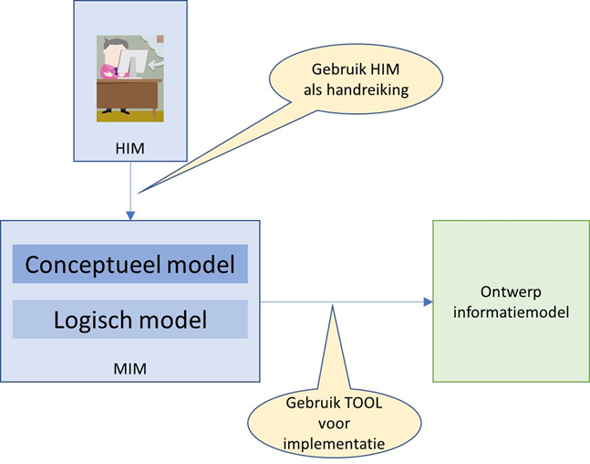

## Tactiek

###	Community

    BOMOS  Community: 
    
    Het is essentieel dat de juiste stakeholders participeren in de community, en dat er niet een onevenwichtige community ontstaat waar slechts een bepaald type stakeholder (bijv. leverancier) in de community actief participeert. Deze taak behelst het bewaken en bevorderen van een goede samenstelling van de community.

De community van MIM (en HIM) omvat geen eindgebruikers van informatie maar specialisten die zich bezighouden met het opstellen van informatiemodellen. 
Een aantal relevante stakeholders:
-	Het ministerie van BZK
         - DSO - Digitaal Stelsel Omgevingswet
         - BRO - Basisregistratie Ondergrond
         - DisGeo - doorontwikkeling geobasisregistraties in samenhang
-	Kadaster
-	Geonovum
-	VNG Realisatie
-	Werkgroep GAB – Gemeenschappelijke Afspraken Berichten

Daarnaast is er de ambitie om MIM uit te dragen als een nationale standaard. In dat geval zijn er ook vele andere overheidsorganisaties die MIM (gaan) toepassen. 

De NORA, de Nederlandse Overheid Referentie Architectuur refereert ook naar MIM als een gemeenschappelijk vetrekpuntvoor het opstellen van inforamtiemodellen (https://www.noraonline.nl/wiki/MIM_(Metamodel_voor_informatiemodellen) en noemt ook overheidsorganisaties die MIM toepassen.

Er is overleg met het Forum voor Standaardisatie of MIM kan worden toegevoegd aan de Lijst met Aanbevolen standaarden van het Forum voor Standaardisatie https://www.forumstandaardisatie.nl/open-standaarden/aanbevolen).

#### Expertgroep

De beheerorganisatie hecht grote waarde aan het actief meedenken van vertegenwoordigers uit de community. Hierdoor worden voorstellen tot aanpassingen beter gewogen. 
Vertegenwoordigers van stakeholders kunnen zich bij de beheerorganisatie melden om deel te nemen aan de expertgroep. Deze deelname is vrijblijvend. Met de MIM-community wordt periodiek afgestemd of deze vertegenwoordiging in balans is met de hele community.
De frequentie van vergaderen van de expertgroep is mede afhankelijk van de hoeveelheid issues en zwaarte van de uit te brengen nnieuwe versie.

###	Architectuur

    BOMOS  Architectuur: 
    
     Het uitzetten en toetsen van de inhoudelijke lijnen en het op hoofdlijnen bewaken van de samenhang tussen de inhoudelijke producten van de community, maar ook met producten van buiten de community zoals aangrenzende standaarden zodat overlap voorkomen wordt. Bijzondere aandacht verdient de relatie met de internationale standaardisatiecommunity.

####	Internationale, Europese en nationale geostandaardisatiegemeenschap

Op de website van Geonovum staat een overzicht van standaardisatieorganisaties op nationaal, Europees en internationaal niveau . Wij zijn op deze drie niveaus actief en daardoor op de hoogte van relevante ontwikkelingen.

Geonovum is lid van het Forum Standaardisatie zodat een goede inbreng van de geo-standaarden naar de e-overheid en visa versa is geborgd. De voorbereidingen van de bijeenkomsten van ISO/TC 211 en CEN/TC 287 en stemmingen worden gedaan in de NEN normcommissie 351 240 Geo-informatie . Geonovum is voorzitter van deze normcommissie die bestaat uit een representatieve afvaardiging van Nederlandse belanghebbende organisaties.

Belangrijk uitgangspunt van Geonovum bij standaardisatie is de afstemming met internationale ontwikkelingen. Ontwikkelingen in standaarden op internationaal, Europees en nationaal niveau zijn van invloed op het beheer van de standaarden. Geonovum zorgt ervoor dat nieuwe en veranderde internationale geo-standaarden, indien relevant en door Nederland ondersteund, geadopteerd en erkend worden in Nederland. 

Geonovum behartigt de Nederlandse belangen voor geo-standaarden door actieve participatie binnen de internationale standaardisatiefora ISO/TC 211 , OGC  en W3C . Deze standaardisatie organisaties maken technische geo-standaarden die Nederland semantisch invult. Geonovum is tevens betrokken bij de Europese richtlijn INSPIRE . 
Participatie bestaat onder andere uit deelname aan de werkgroepen, die standaarden ontwikkelen en aanpassen. Daarnaast volgen wij de ontwikkelingen bij en OMG  die zich bezighouden met standaarden voor het web en ICT. En op Europees niveau in CEN/TC 287 .

####	Samenwerking met andere beheerorganisaties

De belangrijkste partijen waarmee in het kader van MIM wordt samengewerkt zijn VNG Realisatie en het Kadaster. Deze organisaties hebben samen met Geonovm ook aan de wieg gestaan van MIM en hebben stappen gezet om MIM toe te passen in hun organisaties.

####	Nederlandse Overheid Referentie Architectuur (NORA)

De Nederlandse Overheid Referentie Architectuur NORA  geeft algemene architectuurprincipes voor domeinarchitecturen, zoals voor het Rijk (MARIJ), provincies (PETRA) en gemeenten (GEMMA). Geo-informatie wordt gezien als een aspect van architectuur. Dit betekent dat geo-informatie niet domeingericht is, maar voor iedereen geldig is of kan zijn. Om deze reden is geo-informatie integraal opgenomen in NORA  vanaf versie 3.0. Het Forum Standaardisatie heeft NORA 3.0 in oktober 2010 goedgekeurd. Er is daarmee een aanvullend NORA dossier Geo-informatie beschikbaar gekomen . Het kennisplatform NORA online is uitgebreid, conform NORA 3.0, met het thema GEO .

De NORA-architecten hebben interesse in MIM en het idee is dat binnen de NORA-wiki een pagina over MIM wordt opgenomen die door Geonovum wordt beheerd. Definitieve werkafspraken moeten hierover worden gemaakt.

####	Raamwerk van geo-standaarden niet van toepassing

Het Raamwerk geo-standaarden is een aanvulling op het NORA dossier geo-informatie oOm inzicht te geven in de veelheid van standaarden voor geo-informatie en is door Geonovum opgesteld.

MIM maakt geen onderdeel uit van het Raamwerk voor geo-standaarden. MIM staat los van de inhoud en staat daarmee ook los van geo-informatie. Het is een generiek referentiemodel.

####	Rechtenbeleid

    BOMOS  Rechtenbeleid: 
    
     Het voeren van beleid op het gebied van het intellectueel eigendom en copyright rondom de inhoudelijke producten van de community. Maar ook het toetredingsbeleid tot de community, en de rechten (en plichten) van de deelnemers in de community. Daarbij wordt mogelijk onderscheid gemaakt tussen de verschillende rollen die deelnemers in de community kunnen hebben, met andere rechten en plichten.

Het organiseren van auteursrecht en de vrijwaringen op het gebied van intellectueel eigendom zijn zaken die onder rechtenbeleid vallen. Het doel hiervan is de beschikbaarheid van de standaarden inzichtelijk te maken. Geonovum geeft aan hoe, voor wie op welke wijze de standaarden beschikbaar zijn door middel van Creative Commons. 

Elk nieuw document dat vanaf 1 juni 2018 door Geonovum wordt gepubliceerd is voorzien van de volgende licentie: https://creativecommons.org/licenses/by-nd/4.0/deed.nl.

Partijen die bijdragen aan de ontwikkeling van een standaard die door Geonovum wordt beheerd dienen te accepteren dat hun intellectueel eigendomsrecht altijd onder bovenstaande licentie door Geonovum beschikbaar wordt gesteld.

####	Kwaliteitsbeleid en benchmarking

    BOMOS Kwaliteitsbeleid & benchmarken: 
    
    Belangrijk is om aandacht te hebben voor de kwaliteit van de standaarden door middel van een kwaliteitsbeleid. Dit kan resulteren in bijvoorbeeld het introduceren van een kwaliteitscheck voordat een standaard wordt gepubliceerd. Benchmarken is de activiteit om de eigen activiteiten te spiegelen aan vergelijkbare organisaties om mogelijke verbeteringen te identificeren.

figuur:

 
####	Adoptie en erkenning

    BOMOS Adoptie & erkenning: 
    
    Het opstellen van een adoptiestrategie om ervoor te zorgen dat de markt de standaarden adopteert. Onderdeel van een adoptiestrategie kan zijn het nastreven van erkenning door externe ’statusverleners’ bijvoorbeeld de ‘pas toe of leg uit’ lijst6, of om de standaard uit te brengen als NEN-document (NTA, NPR of norm).

Een van de activiteiten in het beheer is het uitdragen van deze standaard, zodat meer en meer volgens dezelfde filosofie informatiemodellen worden ontwikkeld. Er worden op dit moment  de volgende wegen bewandeld om tot een bredere adoptie en erkenning te komen:
- Verzoek tot opname op de Lijst met Aanbevolen Standaarden van het Forum Standaardisatie
- Postionering in de NORA-architectuur

 

 

